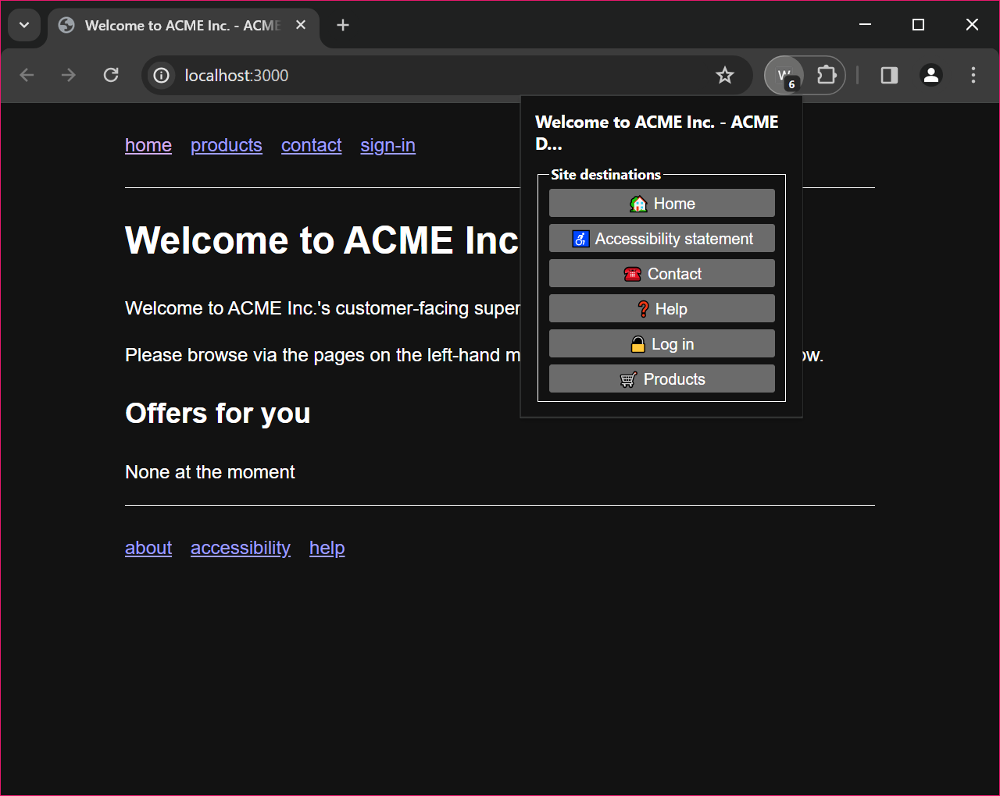

Well-known destinations - demo browser extension
================================================

A prototype/testbed browser extension that follows the WAI-Adapt 'Well-known destinations' proposal.

**This is a demo extension for developer use only - it is not an assistive technology, and it is not suitable for users. Please read the warning and note below.**

The Well-known destinations proposal is in the very early stages of development - check back here for updates.

**Warning:** Do not use this extension in your day-to-day browser profile. This is for quick testing only. The domain names of sites you visit when this extension is running are stored in the extension's local storage area unencrypted (as this is the only way to store such information locally). The reason the domain names are stored locally is to prevent sites from being repeatedly asked which well-known destinations they support. The data are _not_ synched to other browsers associated with your browser profile. Uninstalling the extension clears the data. The instructions for running the extension below create a new profile on each run, and the data are removed when you close the browser.

**Note:** At the time of writing, no sites support this spec (it is in the early stages of development), so it's recommended to only use the extension with the test site provided in this repo.

Trying out the extension and test site
--------------------------------------

### You will need

* NodeJS and NPM already installed.

* [Zola](https://www.getzola.org/) installed, to generate the demo site. We are looking at Node-based alternatives that may be easier for you to install.

### First-time set-up

* Check out this repo

* `npm install` - to install required packages

* `npx tsx build.ts` - to transpile the code, and bundle required files.

  - **Note:** On subsequent runs (after making changes), use `npm run build` instead, as this will run the linters too. The other command needs to be run the first time in order to generate files needed to pass the tests.

### Launching the demo site

* `npm start` - the site will be served on `localhost:3000`

### Launching the extension in a test profile

This will open the extension in a new profile, and open the demo site, which provides some well-known destinations.

As described above, extension data when the browser is closed.

**Note:** You will need to pin the extension's icon to the browser's toolbar each time (the profile is created anew each time you run the extension this way).

* `npm run ext:chrome` - launch in Chromium

* `npm run ext:firefox` - launch in Firefox

Sideloading
-----------

You can build and then sideload the extension into your existing browser profile - but for the reasons noted above, this is not yet recommended.

For more information
--------------------

More details will be added here as the spec proposal is developed.
